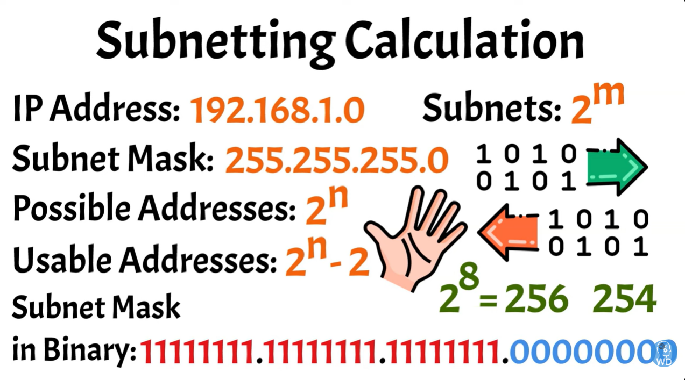
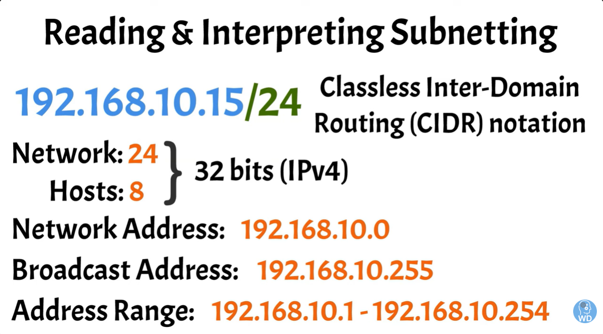
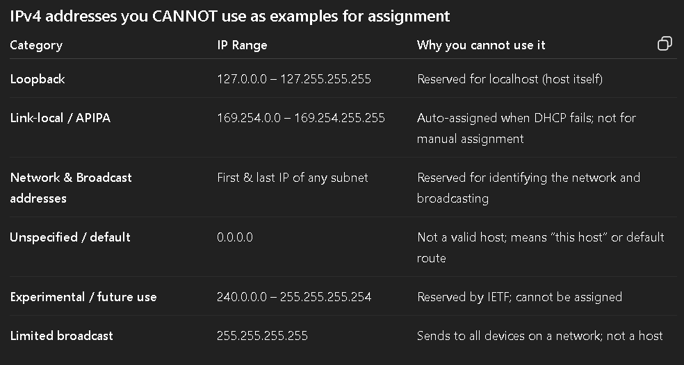

  <h1>The-Network-Cisco-Packet-Tracer</h1>

  
This repository contains my personal exercise in a journey to learn Networking using Cisco Packet Tracers, computer networking simulation software for teaching and learning networking, IoT, and cybersecurity skills in a virtual lab.

 

# Network Topology

 Network topology is a visual map to understand the physical or logical structure of a computer network.

<h2> 2 Types of Network Topology</h2>
<h3>1. Physical Topology</h3>

a type of topology in which all devices and components in the network are drawn in terms of their exact locations. Looking at this topology, it is seen which cabling is made over which paths and devices."
<h3>2. Logical Topology</h3>

does not show the exact location of the devices in the topology like physical topology. It often contains fewer elements than physical topology. Because data flow is important in logical topology.
<h2>Different Kinds of Topology</h2>
<h3>Ring Topology</h3>

 It works in a closed loop logic. The sent data travels around the ring in one direction until it reaches the destination.

<h3>Star Topology</h3>

Each node in the Star topology is connected to a central node. All data flow is done through the central node. Star topology is one of the most common computer network topologies.

<h3>Mesh Topology</h3>

It is a network topology where there is no central node and each node can be directly connected to the other. Mesh topology is not a suitable topology for large networks. It is divided into 2 types:

<h3>Full-Mesh<h3>

 each node in the network is connected to all other nodes by cabling separately. In this topology, it is unlikely that the connection between two nodes will be broken. Because there are alternative ways of connecting.

<h3>Partial-Mesh</h3>

In the Partial-Mesh topology, although each node is not directly connected to all other nodes, they are largely interconnected. Just like in Full-Mesh topology, there are alternative ways to reach the target node in case of disconnection.

<h3>Bus Topology</h3>

is a topology where nodes are located on a common path and data transmission is made with a bidirectional connection on this path. In the bus topology, each node receives every transmitted data even if it does not belong to it. Since there is no hierarchical order among the nodes, there is no transmission priority.

<h3>Point-to-point Topology</h3>

is the simplest topology and consists of two nodes connected together.

<h3>Tree Topology</h3>

is a hybrid network topology formed by connecting star and bus topology. Tree topology has a hierarchical order and each node can have any number of subnodes.

 

# Subnetting

Subnetting is the process of dividing a larger network into smaller, more manageable subnetwors or subnets.

<h2>IP (Internet Protocol) Addresing</h2>

is a unique numerical label assigned to each device connected to a network, allowing it to communicate with other devices. A digital address that helps identify and locate devices within a network or across the internet. IP Address come in two versions: <b>IPv4</b>, which consists of four sets of numbers, and <b>IPv6</b>, which uses a longer format to accommodate the growing number of devices online.

<h2>Subnetmask</h2>

are a crucial companion to IP Addresses. They determine how the address is split between the network portion and the host portion. It consists of a sequence of numbers, typically written in the same format as an IP address, that tells the device how much of the IP address belongs to the network and how much is reserved for the individual device.

<b>126.0.0.0 - 128.0.0.0</b> - primarily reserved for loopback addresses, allowing applications to communicate with the host without requiring an external network (ex. 127.0.0.1).

 

<b>Possible Addresses</b> - where <b>n</b> is the number of bits allocated for the host portion. In the example, the value of n is the <b>8 zeroes</b> that are allocated bits for host which equals to <b>256</b>.

<b>Usable Addresses</b> - The first address in this range is reserved for the <b>network address</b>(subnet itself), and the last address is reserved for the <b>broadcast address</b>, used to send data to all devices in the subnet. In the example, since two of the addresses from the number <b>possible addresses</b> will be allocated to the network and broadcast ID, then the total number of <b>usable addresses</b> will be <b>254</b>.

<b>Subnets</b> - If the network requires more than one subnet, borrowing bits from the host portion is needed.

<h3>Classless Inter-Domain Routing (CIDR) notation</h3>

combining the IP address with a suffix that indicates the number of network bits in the subnet mask.

<h3>List of IPs that cannot be use:</h3>

 

# Types of Networking

The network size can be expressed in terms of the geographic area and the number of machines that are part of the network.

<h3>LAN (Local Area Network)</h3>

 connects computers and devices within a small area like a home, office, or school, allowing them to share resources (files, printers, internet) efficiently using technologies like Ethernet or Wi-Fi, providing fast, secure, and cost-effective communication. It's a network of fewer than 5000 networked computers that span multiple buildings.

<h3>PAN (Personal Area Network)</h3>

is a computer network for interconnecting electronic devices within an individual person's workspace. A PAN provides data transmission among devices such as computers, smartphones, tablets and personal digital assistants.

<h3>WAN (Wide Area Network)</h3>

a network system that could connect between other LANs or MANs using telephone lines, and radio waves. It is mainly limited to an enterprise or an organization.

<h3>MAN (Metropolitan Area Network)</h3>

is a computer network in a community, college campus, or a small region. This network is bigger than a LAN, which is often confined to a single building or venue. This kind of network enables you to cover an area from few miles to tens of miles, depending on the setup.

# Cisco Packet Tracer

### Visit their official website by clicking 👾<a href="https://www.netacad.com/cisco-packet-tracer">here</a>👾. 

Create your own Cisco account by registering through any email accounts or via google account. Then, click their module for <b>Getting Started with Cisco Packet Tracer</b> which will give you the installation link of the software witihn its modular. Once installed, login the account you created and you can now start learning.

## 01. Connecting 2 PCs with a Cross FastEthernet Cable

  

## 02. Connecting PCs to Switch using Cooper Straight Through cable

  

## 03. Separating 4Pcs via VLAN with 2 PCs each

  

  

# GLOSSARY

<ol>
  <li>
    <b>RIP (Routing Information Protocol)</b> - is an older, simple distance-vector interior gateway protocol (IGP) designed for small networks, using hop count as a metric (max 15) to determine the best path. It runs on UDP port 520, sharing full routing tables every 30 seconds. 
  </li>
  <li>
    <b>EIGRP (Enhanced Interior Gateway Routing Protocol)</b> - is a Cisco proprietary protocol. Considered to be easier to configure and manage than OSPF. It uses a <b style="color:MediumSeaGreen;">hybrid routing protocol</b> that combines features of both <b style="color:MediumSeaGreen;">distance vector</b> and <b style="color:MediumSeaGreen;">link-state</b> routing protocols. To calculate the best path to a destination, it uses a composite metric that takes into account factors such as bandwidth, delay, reliability, and load. Supports different  network topologies, including hub-and-spoke, point-to-point, and mesh.
    </li>
  <li>
    <b>OSPF (Open Shortest Path First)</b> - is an open standard protocol. Suited for larger networks with complex topologies. It uses <b style="color:MediumSeaGreen;">pure link-state</b> protocol. To calculate the best path to a destination, OSPF uses a cost-based metric that is calculated based on the bandwith of the links.
  </li>
  <li>
    <b>BGP (Border Gateway Protocol)</b> - is the standardized exterior gateway protocol designed to exchange routing and reachability information among autonomous systems (AS) on the Internet, serving as the "postal service" or "GPS" for Internet traffic. It determines the most efficient paths for data transmission across the internet's network of networks, connecting ASs managed by ISPs, corporations, or universities. 
  </li>
  <li>
    <bi>IS-IS (Intermediate System to Intermediate System)</bi> - is a robust, scalable link-state Interior Gateway Protocol (IGP) used to efficiently move data within large enterprise and service provider networks. It operates directly at Layer 2 (Data Link Layer), allowing it to efficiently route IPv4 and IPv6, while supporting rapid convergence, hierarchical design, and high stability. 
  </li>
  <li>
    <b>FLSM (Fixed Length Subnet Masks)</b> - is an IP subnetting method where all created subnets are the same size, using the same subnet mask, which simplifies configuration but can waste IP addresses if network segments have different host needs, unlike its counterpart VLSM (Variable Length Subnet Mask).
  </li>
  <li>
    <b>VLSM (Variable Length Subnet Masks)</b> - the ability to use different subnet masks for different subnets within the same network. It optimizes within an organization by creating subnets of different sizes, matching actual host needs (e.g., 10 hosts vs. 50 hosts) with different subnet masks (like /27, /26) to reduce waste.
  </li>
  <li>
    <b>CIDR (Classless Inter-Domain Routing)</b> - a method for ISPs and routers to manage large blocks of IP addresses and reduce the size of global routing tables. It optimizes between organizations, allowing ISPs to allocate large address blocks and aggregate them into single routes (supernetting), simplifying internet routing tables. 
  </li>
  <li>
    <b>ARPANET (Advanced Research Projects Agency Network)</b> - is a computer network considered the foundation of the internet. The basis of Internet technologies are the technologies used in ARPANET. In 1969, ARPANET was connected to three university networks in the USA, creating a computer network. Later, this structure expanded and grew even more.
  </li>
  <li>
    <b>IANA (Internet Assigned Numbers Authority)</b> - a crucial global body that coordinates unique identifiers for the internet, managing IP addresses, DNS root zone, and protocol parameters to keep the digital world organized, working under ICANN (Internet Corporation for Assigned Names and Numbers) and providing vital functions like the Time Zone Database. 
  </li>
  <li>
    <b>ICANN (Internet Corporation for Assgined Names and Numbers)</b> - is a global, non-profit organization that coordinates the unique identifiers for the internet, like domain names (e.g., .com, .org) and IP addresses, ensuring the internet's stable, secure, and unified operation by managing the Domain Name System (DNS) and related technical parameters. Essentially, it acts as the internet's phonebook administrator, preventing conflicts and allowing smooth navigation for users worldwide. 
  </li>
  <li>
    <b>Network Topology</b> - is a visual map to understand the physical or logical structure of a computer network. The locations of the devices and cables in the network are among the factors that determine the network topology.
  </li>
  <li><b>EtherChannel</b> - Allows multiple physical Fast Ethernet links to combine into one logical channel. Maximum of 8 links can be aggregated to form a single logical link. Criteria to form an EtherChannel, all ports should have:
    <ul>
      <li>Same Duplex</li>
      <li>Same Speed</li>
      <li>Same VLAN Config (i.e., native VLAN and allowed VLAN)</li>
      <li>switch port modes should be same(access or trunk)</li>
      <li><b>EtherChannel Protocols</b>
        <ol>
          <li><b>Port Aggregation Protocol (PAgP)</b> - is a Cisco proprietary protocol used to form an EtherChannel.
            <ul>
              <li><b>ON:</b> In this mode, the interface will be a part of EtherChannel but no negotiation takes place.</li>
              <li><b>DESIRABLE:</b> In this mode, the interface will continuously attempt to convert other side of the interface into an EtherChannel.</li>
              <li><b>AUTO:</b> In this mode, the interface will become a part of EtherChannel if and only if it is requested by the opposite interface.</li>
              <li><b>OFF:</b> In this mode, No EtherChannel configured on the interface.</li>
            </ul>
          </li>
          <li><b>Link Aggregation Control Protocol (LACP)</b> - is an IEEE 802.3ad standard protocol that combines multiple physical Ethernet links into a single, high-bandwidth logical link (a Link Aggregation Group or LAG). It enhances network reliability, provides automatic failover if a link fails, and enables dynamic configuration between switches, routers, and servers.
            <ul>
              <li><b>ON:</b> In this mode, the interface will be a part of EtherChannel but no negotiation takes place.</li>
              <li><b>ACTIVE:</b> In this mode, the interface will continuously attempt to convert other side of the interface into an EtherChannel.</li>
              <li><b>PASSIVE:</b> In this mode, the interface will become a part of EtherChannel if and only if it is requested by the opposite interface.</li>
              <li><b>OFF:</b> In this mode, No EtherChannel configured on the interface.</li>
            </ul> 
          </li>
          <li><b>Manual EtherChannel Configuration (Static)</b> - directly binds physical switch ports into a single logical channel without using negotiation protocols like LACP or PAgP. It requires identical settings—speed, duplex, and VLANs—on both ends, as misconfiguration can lead to packet loss or spanning-tree loops. 
            <ul>
              <li><b>ON:</b> In this mode, the interface will be a part of EtherChannel but no negotiation takes place.</li>
              <li><b>OFF:</b> In this mode, No EtherChannel configured on the interface.</li>
            </ul> 
          </li>
        </ol>
    </ul>
  </li>
  <li><b>STP (Spanning Tree Protocol)</b> - a Layer 2 network protocol that ensures a loop-free, logical topology in Ethernet networks with redundant links. By blocking redundant paths and keeping a single active link, STP prevents broadcast storms and bridge loops. It uses Bridge Protocol Data Units (BPDUs) to elect a root bridge and calculate the most efficient path. 
    <ol>
      <li><b>Electing a Root Bridge</b> - The lowest bridge id value will be elected as the root bridge. <b>Criteria are Priority + VLAN numbers</b>, which can be configured for influncing the election process. The lowest priority value are preferred, its default value is 32768. <b>System MAC Address</b> is the second part and only be used when there's a <b>tie</b>, means there's two or more switches with the same priority value.</li>
      <li><b>Root Port Selection</b> - each non-root bridge selects one root port (RP), which is the port with the lowest cumulative path cost to the root bridge. If costs are equal, it chooses the port with the lowest neighbor bridge ID, then the lowest sender port ID. All root ports are set to forwarding.
       
       
        <ul>
          <table style="width:100%">
            <tr>
              <th>Port Roles</th>
              <th>Description</th>
            </tr>
            <tr>
              <td>Root Port</th>
              <td>Represent the best path towards the Root Bridge</th>
            </tr>
            <tr>
              <td>Designated Port</th>
              <td>Points away from the root</th>
            </tr>
            <tr>
              <td>Blocked Port</th>
              <td>Does not forward any Ethernet Traffic. But still listens BPDU, which can be an alternative port when the main path fails.</th>
            </tr>
          </table>
          <li><b>Root Path Cost</b> - depends on the speed of the ports:
             
             
            <table style="width:100%">
              <tr>
                <th>STP Cost</th>
                <th>Port Speed</th>
              </tr>
              <tr>
                <td>2</td>
                <td>10Gbps</td>
              </tr>
              <tr>
                <td>4</td>
                <td>1Gbps</td>
              </tr>
              <tr>
                <td>19</td>
                <td>100Mbps</td>
              </tr>
              <tr>
                <td>100</td>
                <td>10Mbps</td>
              </tr>
            </table>
            
If there's a tie, here's a sequential process till the lowest port number:

            <table style="width:100%">
              <tr>
                <th>First</th>
                <th>Second</th>
                <th>Third</th>
                <th>Fourth</th>
              </tr>
              <tr>
                <td>Lowest Path Cost</td>
                <td>Lowest Bridge ID</td>
                <td>Lowest Port Priority</td>
                <td>Lowest Port Number</td>
              </tr>
            </table>
          </li>
          <li><b>STP Port States</b> - to manage how switch ports behave to prevent network loop. Also determine the roles of each ports on process.
            

              
            

          </li>
        </ul> 
      </li>
    </ol>
  </li>
  <li><b>DHCP Snooping</b> - is a security technology on a Layer 2 network switch that can prevent unauthorized DHCP Servers from accessing your network.
  </li>
  <li><b>Address Resolution Protocol (ARP)</b>  -is a fundamental networking protocol used to map a dynamic, logical IP address (Layer 3) to a fixed, physical MAC address (Layer 2) on a local area network (LAN). When a device wants to communicate with another device on the same network, it uses ARP to find the destination's MAC address if only the IP address is known. To improve efficiency, devices store these mappings in an "ARP cache" (or table) to avoid repeating the broadcast process for every packet.
  </li>
  <li><b>Dynamic ARP Inspection (DAI)</b> - is a security feature that rejects invalid and malicious ARP Packets.
    <ul>
      <li>DAI relies on DHCP Snooping</li>
      <li>DHCP snooping listens to DHCP message exchanges</li>
      <li>DHCP builds a bindings database of valid tuples:</li>
        <ul>
          <li>MAC Address</li>
          <li>IP Address</li>
          <li>VLAN Interface</li>
        </ul>
    </ul>
  </li>
  <li><b>IP Source Guard</b> - prevents IP and/or MAC address spoofing attacks on untrusted layer two interfaces.
     
    • Source guard relies on DHCP Snooping database to do its work. Only used on layer two (access and trunk) interfaces and it only works inbound.
  </li>
</ol>
