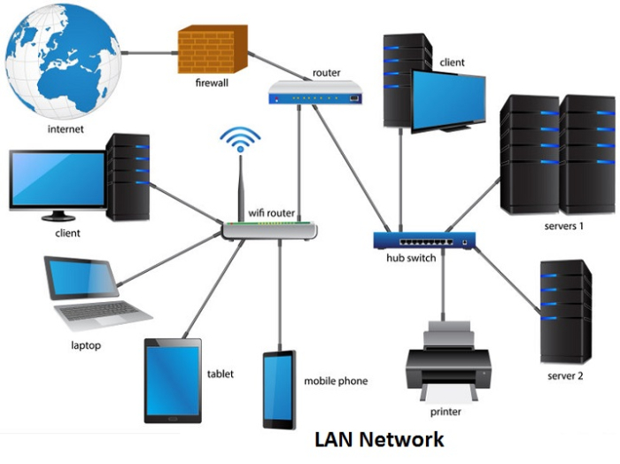
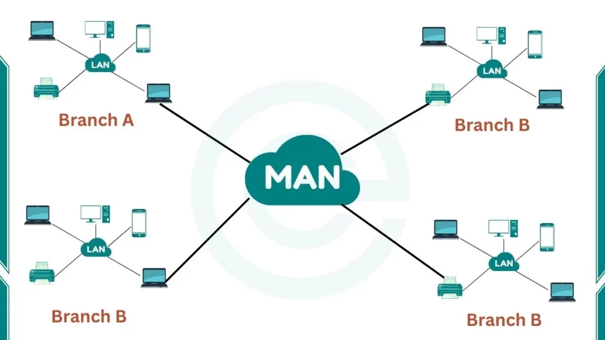
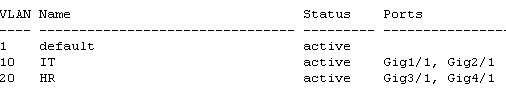
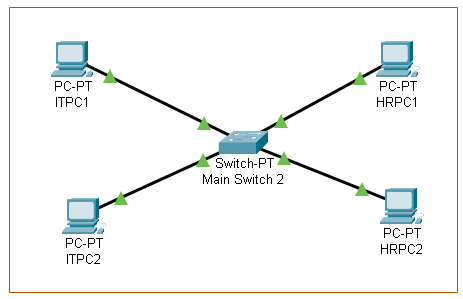

  <h1>The-Network-Cisco-Packet-Tracer</h1>

  
This repository contains my personal exercise in a journey to learn Networking using Cisco Packet Tracers, computer networking simulation software for teaching and learning networking, IoT, and cybersecurity skills in a virtual lab.

 

# Network Topology

 Network topology is a visual map to understand the physical or logical structure of a computer network.

<h2> 2 Types of Network Topology</h2>
<h3>1. Physical Topology</h3>

a type of topology in which all devices and components in the network are drawn in terms of their exact locations. Looking at this topology, it is seen which cabling is made over which paths and devices."
<h3>2. Logical Topology</h3>

does not show the exact location of the devices in the topology like physical topology. It often contains fewer elements than physical topology. Because data flow is important in logical topology.
<h2>Different Kinds of Topology</h2>
<h3>Ring Topology</h3>

 It works in a closed loop logic. The sent data travels around the ring in one direction until it reaches the destination.

<h3>Star Topology</h3>

Each node in the Star topology is connected to a central node. All data flow is done through the central node. Star topology is one of the most common computer network topologies.

<h3>Mesh Topology</h3>

It is a network topology where there is no central node and each node can be directly connected to the other. Mesh topology is not a suitable topology for large networks. It is divided into 2 types:

<h3>Full-Mesh<h3>

 each node in the network is connected to all other nodes by cabling separately. In this topology, it is unlikely that the connection between two nodes will be broken. Because there are alternative ways of connecting.

<h3>Partial-Mesh</h3>

In the Partial-Mesh topology, although each node is not directly connected to all other nodes, they are largely interconnected. Just like in Full-Mesh topology, there are alternative ways to reach the target node in case of disconnection.

<h3>Bus Topology</h3>

is a topology where nodes are located on a common path and data transmission is made with a bidirectional connection on this path. In the bus topology, each node receives every transmitted data even if it does not belong to it. Since there is no hierarchical order among the nodes, there is no transmission priority.

<h3>Point-to-point Topology</h3>

is the simplest topology and consists of two nodes connected together.

<h3>Tree Topology</h3>

is a hybrid network topology formed by connecting star and bus topology. Tree topology has a hierarchical order and each node can have any number of subnodes.

 

# Types of Networking

The network size can be expressed in terms of the geographic area and the number of machines that are part of the network.

<h3>LAN (Local Area Network)</h3>

 connects computers and devices within a small area like a home, office, or school, allowing them to share resources (files, printers, internet) efficiently using technologies like Ethernet or Wi-Fi, providing fast, secure, and cost-effective communication. It's a network of fewer than 5000 networked computers that span multiple buildings.

<h3>PAN (Personal Area Network)</h3>

is a computer network for interconnecting electronic devices within an individual person's workspace. A PAN provides data transmission among devices such as computers, smartphones, tablets and personal digital assistants.

<h3>WAN (Wide Area Network)</h3>

a network system that could connect between other LANs or MANs using telephone lines, and radio waves. It is mainly limited to an enterprise or an organization.

<h3>MAN (Metropolitan Area Network)</h3>

is a computer network in a community, college campus, or a small region. This network is bigger than a LAN, which is often confined to a single building or venue. This kind of network enables you to cover an area from few miles to tens of miles, depending on the setup.

# Cisco Packet Tracer

### Visit their official website by clicking 👾<a href="https://www.netacad.com/cisco-packet-tracer">here</a>👾. 

Create your own Cisco account by registering through any email accounts or via google account. Then, click their module for <b>Getting Started with Cisco Packet Tracer</b> which will give you the installation link of the software witihn its modular. Once installed, login the account you created and you can now start learning.

## 01. Connecting 2 PCs with a Cross FastEthernet Cable

  

## 02. Connecting PCs to Switch using Cooper Straight Through cable

  

## 03. Separating 4Pcs via VLAN with 2 PCs each

  

  

# GLOSSARY

<ol>
  <li>
    <b>EIGRP (Enhanced Interior Gateway Routing Protocol)</b> - is a Cisco proprietary protocol. Considered to be easier to configure and manage than OSPF. It uses a <b style="color:MediumSeaGreen;">hybrid routing protocol</b> that combines features of both <b style="color:MediumSeaGreen;">distance vector</b> and <b style="color:MediumSeaGreen;">link-state</b> routing protocols. To calculate the best path to a destination, it uses a composite metric that takes into account factors such as bandwidth, delay, reliability, and load. Supports different  network topologies, including hub-and-spoke, point-to-point, and mesh.
    </li>
  <li>
    <b>OSPF (Open Shortest Path First)</b> - is an open standard protocol. Suited for larger networks with complex topologies. It uses <b style="color:MediumSeaGreen;">pure link-state</b> protocol. To calculate the best path to a destination, OSPF uses a cost-based metric that is calculated based on the bandwith of the links.
  </li>
  <li>
    <b>FLSM (Fixed Length Subnet Masks)</b> - is an IP subnetting method where all created subnets are the same size, using the same subnet mask, which simplifies configuration but can waste IP addresses if network segments have different host needs, unlike its counterpart VLSM (Variable Length Subnet Mask).
  </li>
  <li>
    <b>VLSM (Variable Length Subnet Masks)</b> - the ability to use different subnet masks for different subnets within the same network. It optimizes within an organization by creating subnets of different sizes, matching actual host needs (e.g., 10 hosts vs. 50 hosts) with different subnet masks (like /27, /26) to reduce waste.
  </li>
  <li>
    <b>CIDR (Classless Inter-Domain Routing)</b> - a method for ISPs and routers to manage large blocks of IP addresses and reduce the size of global routing tables. It optimizes between organizations, allowing ISPs to allocate large address blocks and aggregate them into single routes (supernetting), simplifying internet routing tables. 
  </li>
  <li>
    <b>ARPANET (Advanced Research Projects Agency Network)</b> - is a computer network considered the foundation of the internet. The basis of Internet technologies are the technologies used in ARPANET. In 1969, ARPANET was connected to three university networks in the USA, creating a computer network. Later, this structure expanded and grew even more.
  </li>
  <li>
    <b>IANA (Internet Assigned Numbers Authority)</b> - a crucial global body that coordinates unique identifiers for the internet, managing IP addresses, DNS root zone, and protocol parameters to keep the digital world organized, working under ICANN (Internet Corporation for Assigned Names and Numbers) and providing vital functions like the Time Zone Database. 
  </li>
  <li>
    <b>ICANN (Internet Corporation for Assgined Names and Numbers)</b> - is a global, non-profit organization that coordinates the unique identifiers for the internet, like domain names (e.g., .com, .org) and IP addresses, ensuring the internet's stable, secure, and unified operation by managing the Domain Name System (DNS) and related technical parameters. Essentially, it acts as the internet's phonebook administrator, preventing conflicts and allowing smooth navigation for users worldwide. 
  </li>
  <li>
    <b>Network Topology</b> - is a visual map to understand the physical or logical structure of a computer network. The locations of the devices and cables in the network are among the factors that determine the network topology.
  </li>
</ol>
